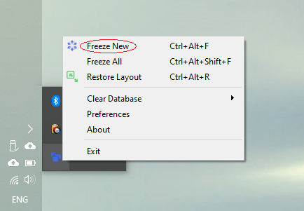
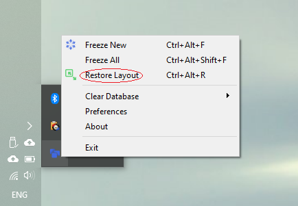
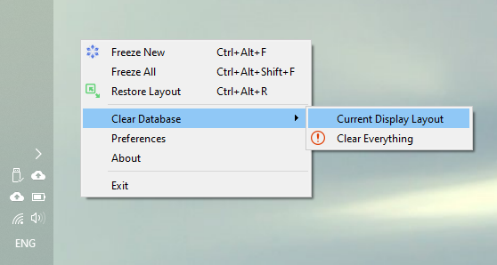

# LayoutFreezer

Have you ever find find yourself moving and resizing open windows on your desktop each time when you reconnect your laptop to your docking station or external displays after another meaningful meeting in the office, because they are just piled up on top of each other in the middle of the screen? Have you ever wished that OS could remember the way you positioned those windows when changing display configuration? If so, this app may be of help to you.

LayoutFreezer is a system tray app that allows users to save coordinates for opened windows for each display configuration that you work with (that is number of displays, their sizes, orientation and location relative to each other). These coordinates can be used at a later time to restore desired window layout after any change, like moving/resizing opened applications or connecting/disconnecting external monitors.

## Current Release: 0.4.4

#### Release Notes:
- Added support for hotkeys
- Added icons and hotkey indicators to menu items
- Implemented GUI dialogs: About, Preferences, Warning
- Split Clear Database into two options: Current Layout and Everything
- Implemented old logs disposal (max number of log files is set in config.yml)
- Added Install/Uninstall scripts (Windows)
- Implemented basic guessing the most appropriate location for opened apps that have saved configs for other desktop layouts but not for the current one.

## Installation & Removal
LayoutFreezer currently supports only Winows.
1. Download and unzip. Destination directory will become installation directory.
2. Run **install.ps1** or **uninstall.ps1** in the package root to install/uninstall.
`Installation simply creates scheduled task to run LayoutFreezer at logon.`
`Installs for current user only.`

## How To:
After starting LF for the first time, move/resize opened windows into desired layout and run **Freeze** command either from systray app menu or by using hotkeys. Doing so will save current display layout and opened windows configurations into the database.
`(!) To include minimized windows, enable corresponding checkbox in Preferences`

###### Multiple display layouts
You can save apps configurations for each display layout that you work with (for example, you might have one external monitor at home and three-monitor docking station at work; or work in rotation with monitors in landscape and portrait orientation). LayoutFreezer will automatically create a new configuration set in the database if current display layout is not recognized when you run **Freeze** command.

###### Add new application to saved layout
Run **Freeze New** command to only add those opened windows configurations that are not already in the database. Windows with *process name* and *title* that match exactly any configuration found in the database are skipped. This allows multiple windows of the same app to be saved individually.
`(!) To include minimized windows, enable corresponding checkbox in Preferences`

###### Force save all opened windows
Run **Freeze All** command to force save configurations of all currently opened windows. If a window config with matching *process name* and *title* is found in database, it will be replaced.
`(!) To include minimized windows, enable corresponding checkbox in Preferences`

###### Restore layout
Run **Restore Layout** any time to restore saved windows size/position configurations of the opened apps for the current display layout.
`(!) To include minimized windows, enable corresponding checkbox in Preferences`

> Under the hood:
- There must be at least one configuration in the database for an app to be restored.
- Restore operation only affects windows for currently opened application
- Minimized windows will be skipped unless *Include Minimized* checkbox is selected in Preferences
- When searching database for saved configurations:
1. First app configs for current display layout are considered
2. If exact match found in database then configuration is used to restore window size/position. Exact match means that both*process name* and *title* of saved configuration match exactly those of the window that is currently being restored.
3. If saved configs for current app are found in the database but titles do not match exactly, the configuration with the closest matching title will be used. Preferences parameter*Match Cutoff* controls the minimum similarity treshhold; titles that do not pass it will not be considered.
4. If no exact or similar configurations found in the current display layout, then LayoutFreezer will search database for all the configurations for the current app across all display layouts and try to guess the most appropriate position/size based on the following factors: most frequent *display orientation*, *dispaly index* from left to right, and whether display is *primary*.
5. If no configurations for currently restored app can be found in the database, it is skipped.

###### Clear database
If you noticed that restore operation became less reliable because there are too many different configurations for each app in the database and they are not always picked correctly, you can clean app configurations and start afresh. You have two options here:
- remove only app configurations for current display layout, but leave all the rest; or
- wipe database clean and start over

## Roadmap:
- Log rotation
- Mac/Linux support

###### Tentative:
- ? Auto-Upgrade pref file on version change; warn user if preferences are reset to defaults
- ? Change prefereces dialog into textedit and implement validation on save
- ? Implement handling of windows for app running with elevated privileges (currently unable to enumerate: access denied)
- ? Add known invisible system apps to exclude list

###### Dropped:
- Cosmetic: in Preferences dialog make parameters names bold (groupbox title)

###### Far Far Away:
Ideally, LayoutFreezer should not require user intervention at all to record windows positions ("Freeze Layout"). Instead, it should take a quick snapshot of the current display layout and opened apps windows positions/sizes every now and then, and run machine learning algorithms to learn users apps positioning habits. This data can be used when executing "Restore Layout" to guess the most appropriate window position/size for any given situation.
But thats a tale for another day... 
